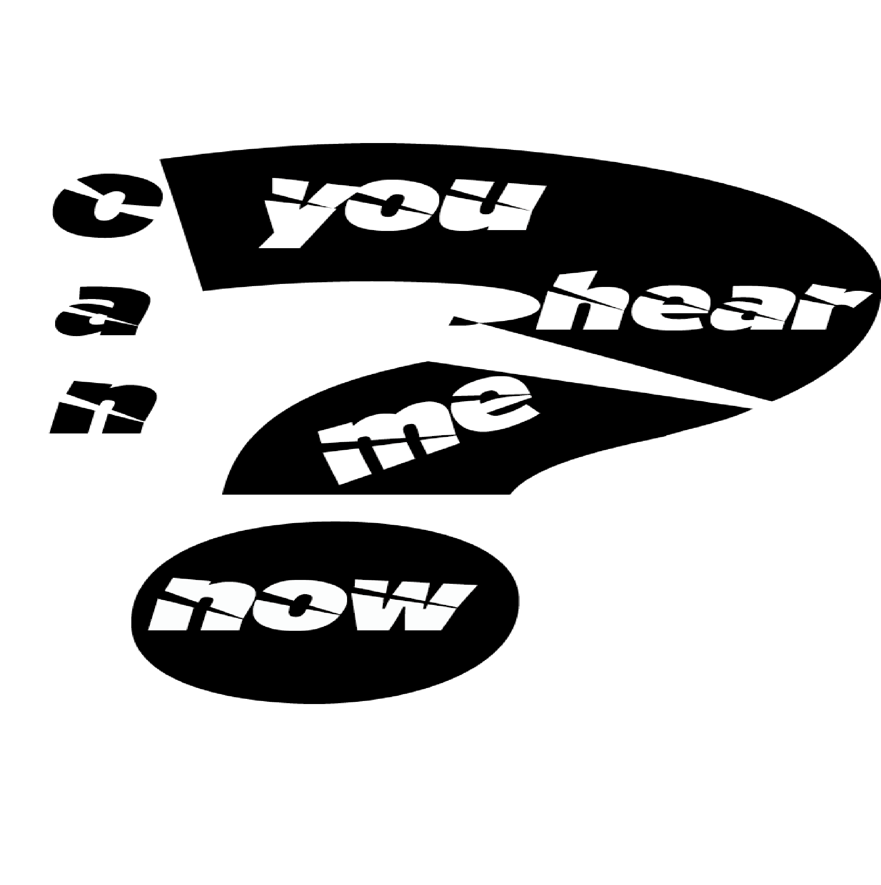
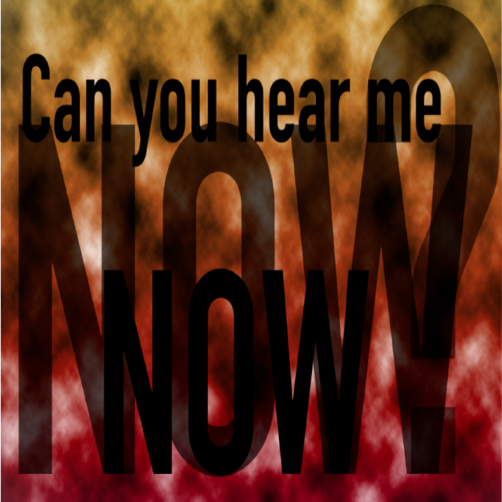
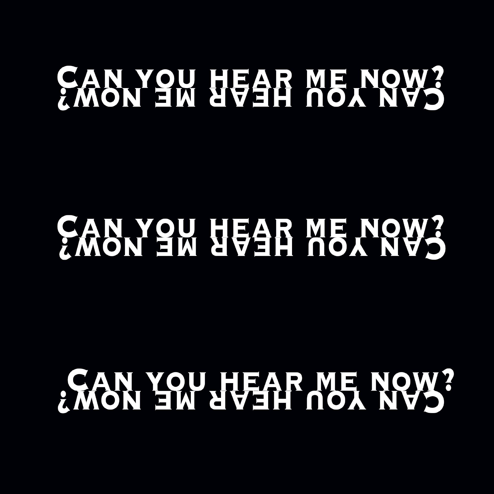

# OneTweet
@Snowdon: Can you hear me now?

####Typography poster 1

I decided to use this typography poster because the question mark I see as the vital part of the tweet. This is because I feel that it can be seen as a sarcastic tweet, and the question mark is emphasising that.

####Typgraphy poster 2

I used a big bold font to shwo the anger side of Snowdens tweet. I also used the firery background to emphasise the anger he is showing.

####Typography poster 3

I created this poster to show a refelctive element in terms of the postion of the text. The font seems quite a classy and important font, so it reflects how Snowdon sees his life.

####Typography poster 4
![image] (Typography4.png)

I chose to create this poster because firstly it has the twitter font, and it links with the retween symbol. I also chose this symbol because this tweet got over 124,000 retweets.

####Typography poster 5
![image] (typography5.png)

My last poster was my favourit. This is because it firstly has a black and white colour scheme which reflect prison, and also the prison type font which relfects Snowdens life in jail.