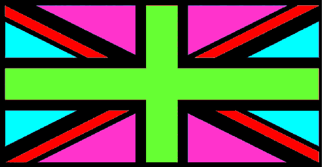
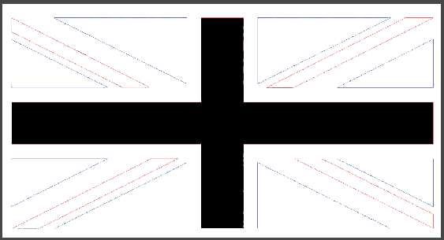
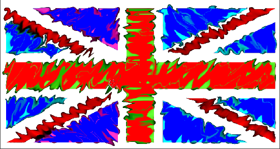
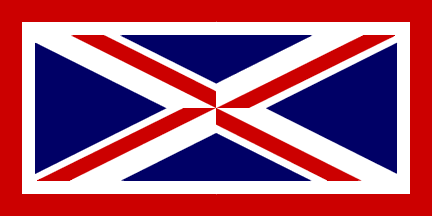
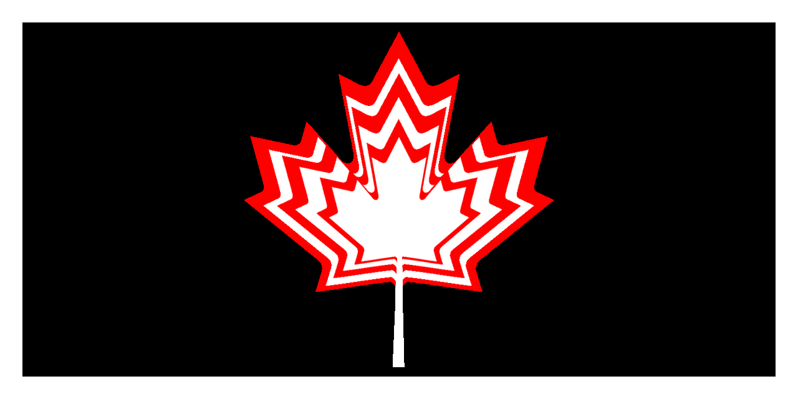
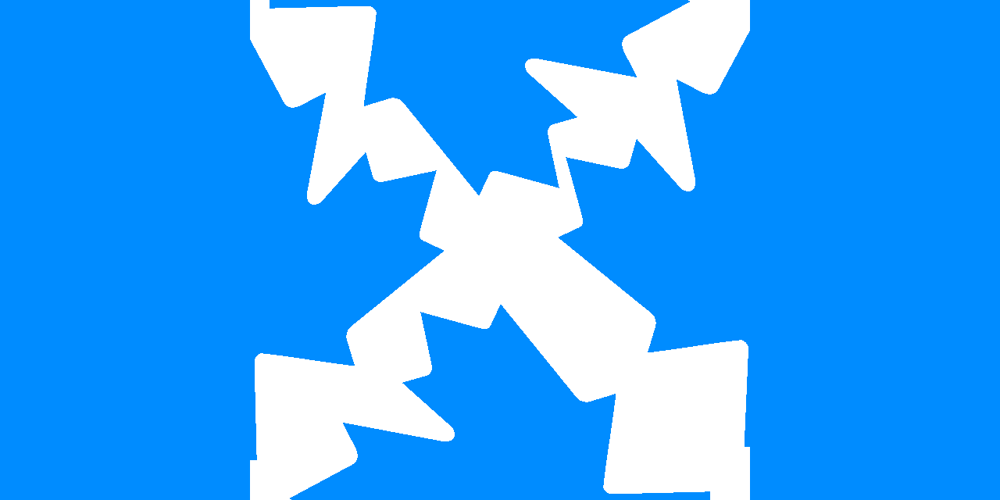
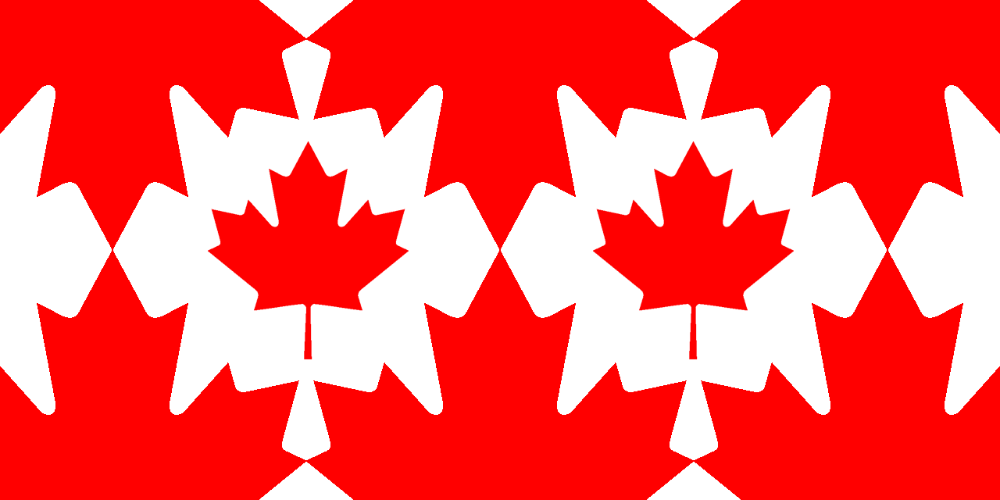
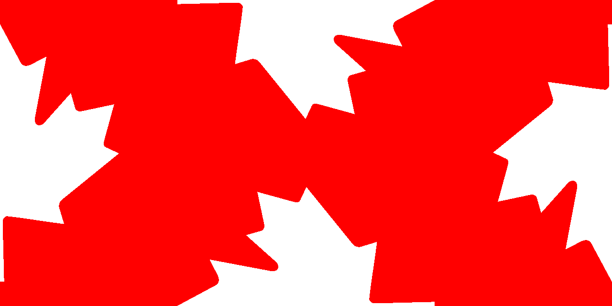
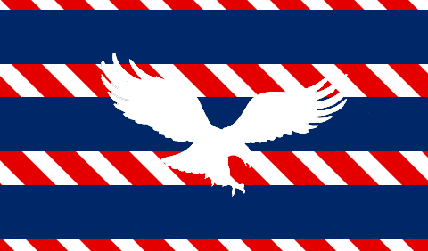

#The Union hack
Changing and creating flags

###Original Version - Great Britain

This is the original version of the Great British flag. We chose this flag because it has a lot of details that we could change, and there are many colours that can fit into the shapes of the flag.

###Version 1

 
###Version 2
 

###Version 3

###Version 4

###Original Version - Canada

###Version 1

###Version 2

###Version 3

###Version 4

##New flag ideas

